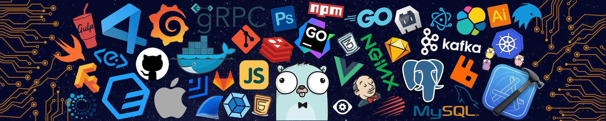

# Hello, I'm kripovskii 👋
```  
    __        _                       __   _ _ 
   / /_______(_)___  ____ _   _______/ /__(_|_)
  / //_/ ___/ / __ \/ __ \ | / / ___/ //_/ / / 
 / ,< / /  / / /_/ / /_/ / |/ (__  ) ,< / / /  
/_/|_/_/  /_/ .___/\____/|___/____/_/|_/_/_/   
           /_/                        
```         
## About Me
- 🔭 I’m currently working on VVSU.
- 🌱 I’m currently learning Swift.

## Skills
- .NET Framework
- C#
- ASP.NET Core
- Entity Framework
- SQL Server
- RESTful APIs
- Git
- HTML/CSS/JavaScript
- Golang
- Python

[](https://skillicons.dev)

## GitHub Stats


